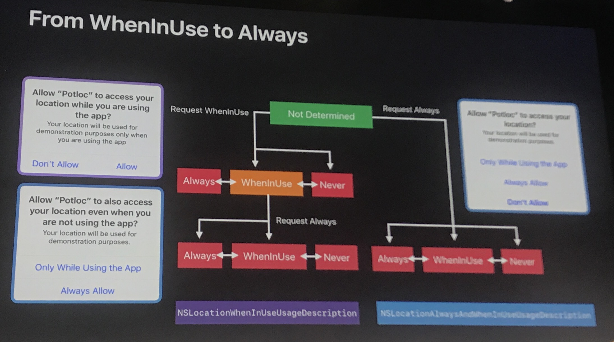

# WWDC17 Overview
<!-- TOC depthFrom:2 depthTo:6 withLinks:1 updateOnSave:1 orderedList:0 -->

- [Impacting Development](#impacting-development)
	- [Swift 4.0](#swift-40-402)
	- [Xcode 9](#xcode-9)
	- [Core Data](#core-data-208)
	- [GCD](#gcd-706)
- [Impacting Design and Features](#impacting-design-and-features)
	- [Password autofill from KeyChain like in Safari](#password-autofill-from-keychain-like-in-safari)
	- [CoreML](#coreml-703--more)
		- [NLP](#nlp208)
		- [Vision](#vision-506)
	- [ARKit](#arkit-602)
	- [Core Bluetooth](#core-bluetooth-712)
	- [Location](#location-713)
	- [Business Chat](#business-chat-240)
- [More interesting sessions](#more-interesting-sessions)

<!-- /TOC -->
## Impacting Development
### Swift 4.0 [(402)](https://developer.apple.com/wwdc17/402)
- Can co-exist with swift 3.2 (So the new
features can be migrated gradually)
- Codeable for serializing objects
- Block KVO [more](https://developer.apple.com/library/content/documentation/Swift/Conceptual/BuildingCocoaApps/AdoptingCocoaDesignPatterns.html#Key-Value%20Observing)
- Combine protocols 
- Strings
  - Substrings made much easier
  - """ for multi-line strings :) (the last quote will determine the indentation for all string)

### Xcode 9
- Code refactoring in Xcode !!  
- Asset catalog
  - Added colors
  - Color for icons
  - PDF - can ship the full size
- New build system, better performance
  - Check out [(416)](https://developer.apple.com/videos/play/wwdc2016/416/)
- GitHub integration
- More
  - Debugging with Xcode 9 [(404)](https://developer.apple.com/wwdc17/404/)
  - Finding bugs using Xcode runtime tools [(406)](https://developer.apple.com/wwdc17/406/)
  - Understanding undefined behavior [(407)](https://developer.apple.com/wwdc17/407/)

### Core Data [(208)](https://developer.apple.com/wwdc17/210/)
  - Persistent history tracking
 
  - More in spotlight integration and indexing

### GCD [(706)](https://developer.apple.com/wwdc17/706/)
 

## Impacting Design and Features
### Password autofill from KeyChain like in Safari
### CoreML [(703)](https://developer.apple.com/wwdc17/703) | [more](https://developer.apple.com/Machine-learning)

  - Not Learning, only inference
  - Vision
    - All new algorithms improvements will be updated in Vision and not in CoreImage
  - NLP
  - Underlying function 
    - Convert existing models to CoreML

- CoreML in depth [(710)](https://developer.apple.com/wwdc17/710)

#### NLP[(208)](https://developer.apple.com/wwdc17/208/)
  - Part of speech
  - Name recognition
  - Dominant language

#### Vision [(506)](https://developer.apple.com/wwdc17/506)
  - Object tracking
  - Face detection

    - High recall, detect even small faces
    - Landmarks

  - Image registration
  - Rectangle detection
  - Barcode
  - Text

### ARKit [(602)](https://developer.apple.com/wwdc17/602)

### Core Bluetooth [(712)](https://developer.apple.com/wwdc17/712)
- Updates in state preservation and restoration: will work after reboot or BT system event
- Available in WatchOS 4, directly connect from Apple watch

- L2CAP support, replacement for GATT

- EDL in Bluetooth 4.2

- revisit [Bluetooth accessory design guideline](https://developer.apple.com/hardwaredrivers/BluetoothDesignGuidelines.pdf)

### WatchOS 4 [(205)](https://developer.apple.com/wwdc17/205)
- Water lock: have the option to leave the app on top even when locked
- Siri watch face: the Siri face will automatically display the most relevant info based on the time, your location, and your routine.

### Location [(713)](https://developer.apple.com/wwdc17/713)
- New authorization flow 
- Floor plan
- WatchOS location in background

### Business Chat [(240)](https://developer.apple.com/wwdc17/240)

## More interesting sessions
- Finding Bugs Using Xcode Runtime Tools
https://developer.apple.com/wwdc17/406
- Advances in Networking, Part 1 https://developer.apple.com/wwdc17/707
- Advances in Networking, Part 2 https://developer.apple.com/wwdc17/709
- Build Better Apps with CloudKit Dashboard https://developer.apple.com/wwdc17/226
- Building Visually Rich User Experiences https://developer.apple.com/wwdc17/235
- Cocoa Development Tips https://developer.apple.com/wwdc17/236
